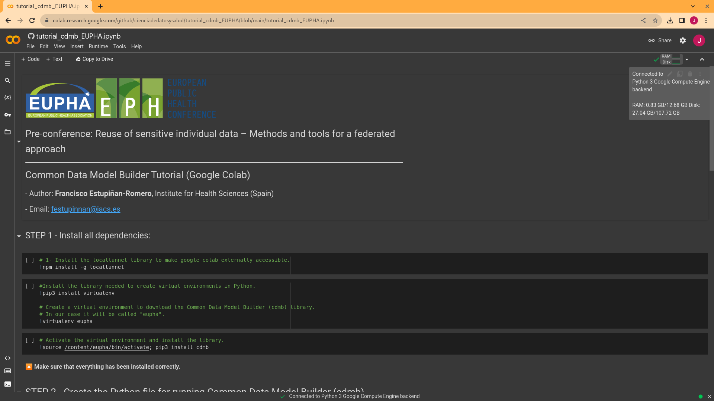

# Pre-conference: Reuse of sensitive individual data – Methods and tools for a federated approach
---
# Common Data Model Builder Tutorial (Google Colab)
### - Author: **Francisco Estupiñan-Romero**, Institute for Health Sciences (Spain)
### - Email: <festupinnan@iacs.es>
---

Welcome to the Common Data Model Builder tutorial!

Before we get started, let's make sure we meet the following requirements:

- You have an internet connection.
- Be logged in with your Google account.

If everything is OK, let's continue! 

In this tutorial we are going to use a Jupyter Notebook.

Available at the following URL:

https://github.com/cienciadedatosysalud/tutorial_cdmb_EUPHA/blob/main/tutorial_cdmb_EUPHA.ipynb

🔮🔮🔮 To open the Notebook in Google Colab add in the URL "tocolab" at the end of "github". Click on the following link 🔮🔮🔮

https://githubtocolab.com/cienciadedatosysalud/tutorial_cdmb_EUPHA/blob/main/tutorial_cdmb_EUPHA.ipynb 

Once we are in Google Colab, we make sure we are connected to the Python 3 Google Compute Engine backend (top right of the screen). 

In case we are not connected, we select connect to get a result as in the image.

Now we are ready to follow the instructions that appear in the notebook.

Enjoy! 😄
